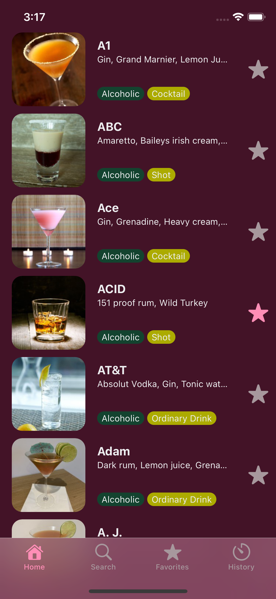

# Aglouglou

This is an [Expo](https://expo.dev) project created with [`create-expo-app`](https://www.npmjs.com/package/create-expo-app).

## Screenshots and screen recording

| Home screen                                                  | Recipe detail                              |
| ------------------------------------------------------------ | ------------------------------------------ |
|  |  |

| Add to favorites                                     | Remove from favorites                                      |
| ---------------------------------------------------- | ---------------------------------------------------------- |
|  |  |

# Getting started

## Setup your device or emulator/simulator in development build without EAS

Follow this [link](https://docs.expo.dev/get-started/set-up-your-environment/?mode=development-build&buildEnv=local)

## Install PNPM

This project use pnpm as a package manager you can follow their doc to install [here](https://pnpm.io/installation)

## Run the project

1. Install dependencies

```bash
pnpm i
```

2. Generate native modules (android/ios folders)

```bash
pnpm prebuild
```

3. Start the app on respective OS locally

```bash
pnpm android|ios
```

You can start developing by editing the files inside the **src/app** directory. This project uses [file-based routing](https://docs.expo.dev/router/introduction).

## Running unit test

```bash
pnpm test
```

## Running e2e test

- First install [maestro](https://maestro.mobile.dev/getting-started/installing-maestro) (tested with version 1.39.7)

- Have an instance of an iPhone simulator or android emulator running with the app installed then run :

```bash
maestro start-device --platform android
```

or

```bash
maestro start-device --platform ios
```

- then run:

```bash
 pnpm e2e
```

# Development workflow

## Adding module

```bash
pnpm i $(package_name)
```

## Updating component UI

Update test snapshot with:

```bash
pnpm test-update
```

## Build app

with eas:

```bash
pnpm build-android|ios
```

without eas (android only):

```bash
cd android && ./gradlew assembleRelease
```

## CocktailDB

Link to the [cocktailDB](https://www.thecocktaildb.com/api.php) API documentation
