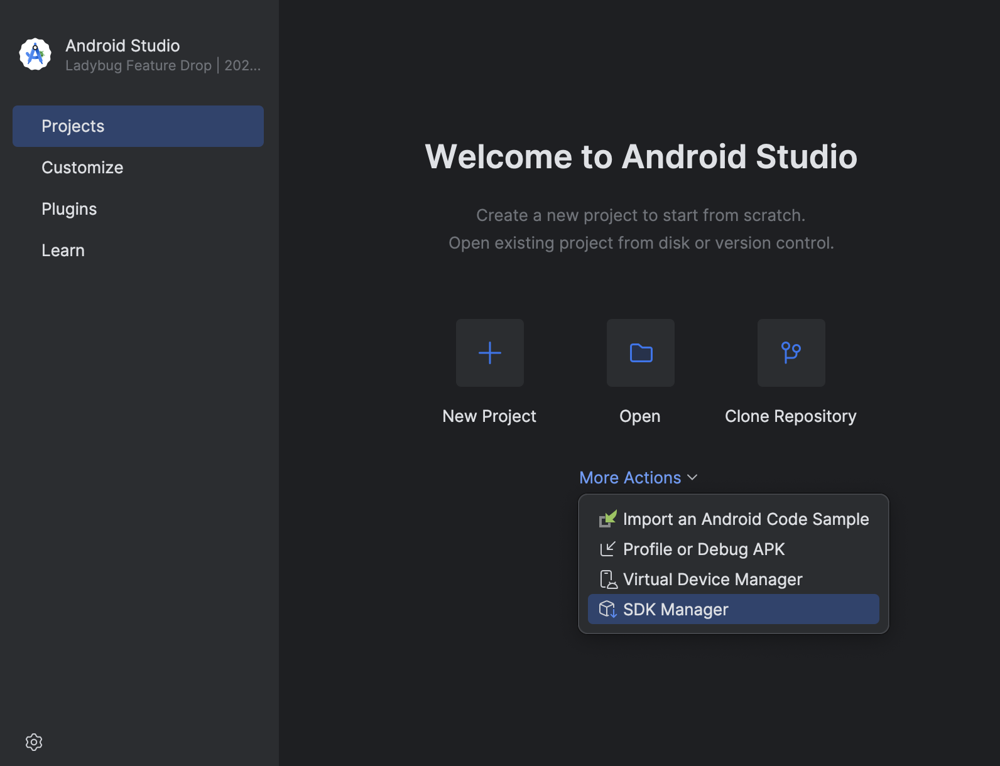
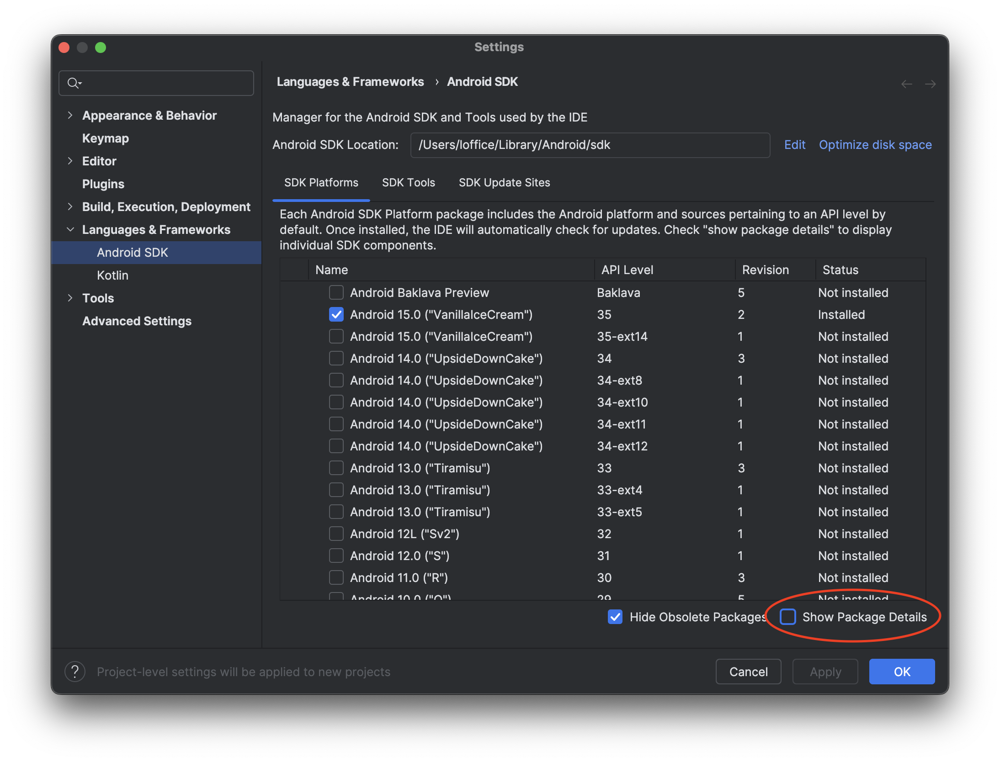
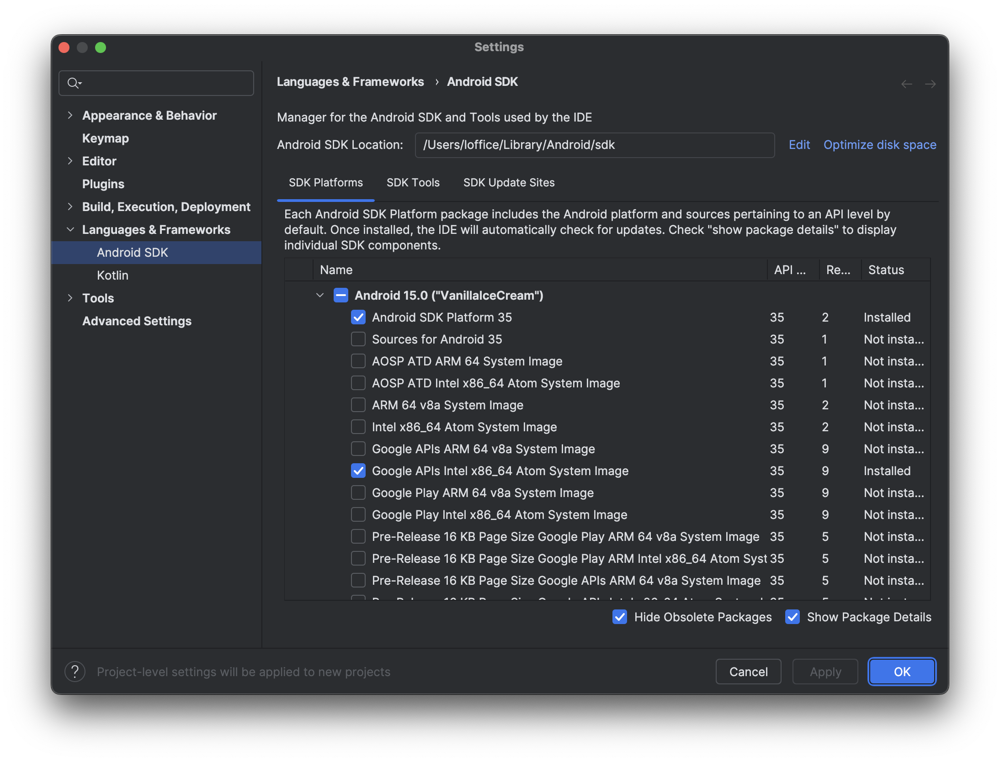
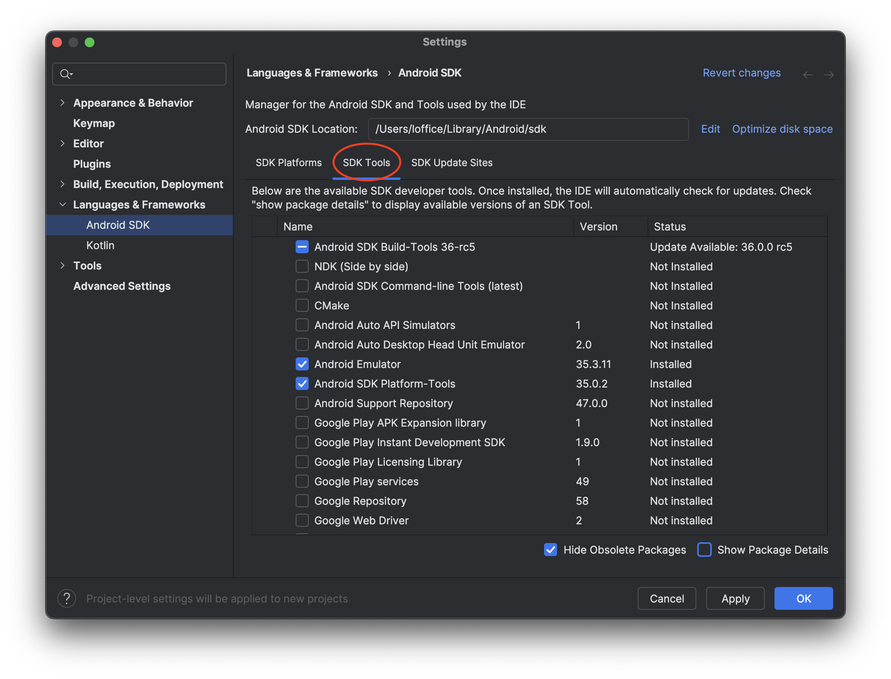
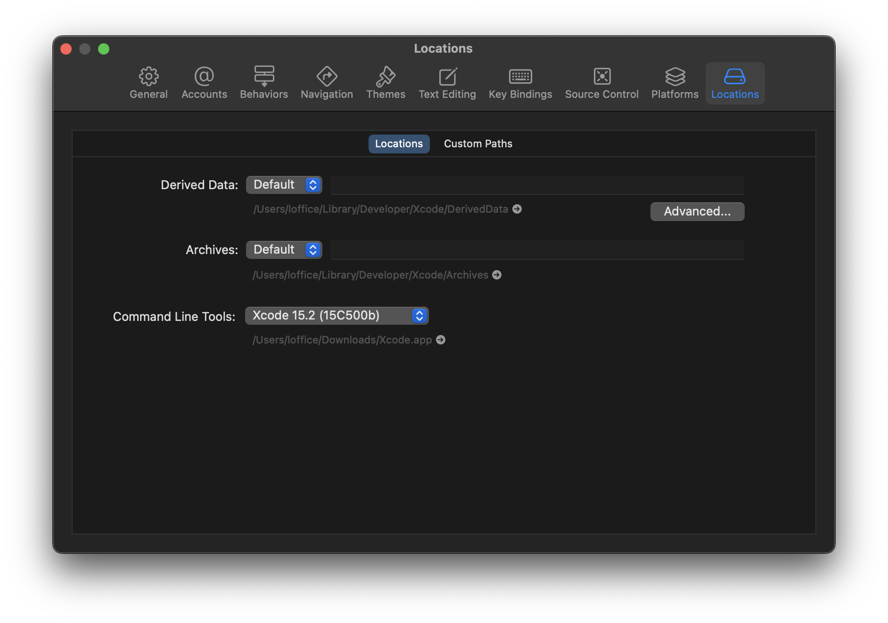

# Setting up environment for mac

All of the following install is using [Homebrew](https://brew.sh/) as a package manager

If any of the following command does not work check their official documentation you can find the link in the title

## Install [Homebrew](https://brew.sh/)

```bash
/bin/bash -c "$(curl -fsSL https://raw.githubusercontent.com/Homebrew/install/HEAD/install.sh)"
```

## Install [PNPM](https://pnpm.io/installation)

```bash
brew install pnpm
```

## Install [Node](https://nodejs.org/fr/download) & [Watchman](https://facebook.github.io/watchman/docs/install)

```bash
brew install node
brew install watchman
```

After installing node make sure the version is 18.18 or newer by running:

```bash
node -v
```

# Setting up Android

## Install [Java Development Kit](https://learn.microsoft.com/fr-fr/java/openjdk/download#openjdk-17)

```bash
brew install --cask zulu@17
```

After installing the JDK (Java Development Kit) using your text editor of choice add the following line in **~/.bash_profile** (or **~/.zshrc** if you use Zsh)

```bash
export JAVA_HOME=/Library/Java/JavaVirtualMachines/zulu-17.jdk/Contents/Home
```

## Download and install Android Studio

If you have a doubt or the instruction is not relevant anymore you can check [expo](https://docs.expo.dev/get-started/set-up-your-environment/?mode=development-build&buildEnv=local&platform=android&device=simulated) or [react native](https://reactnative.dev/docs/set-up-your-environment?platform=android) documentation

Go [here](https://developer.android.com/studio/index.html) to download Android Studio.

After installing Android Studio open the "SDK Manager" under the "More Actions" dropdown.



Check the "Show Package Details" box in the bottom right corner.



Expand the Android 15 (VanillaIceCream) entry then make sure the following items are checked:

- `Android SDK Platform 35`
- `Google Play Intel x86_64 Atom System Image or Intel x86_64 Atom System Image or (for Apple M1 Silicon) Google APIs ARM 64 v8a System Image`



Next select the "SDK Tools" tab and make sure you have at least one version of the **Android SDK Build-Tools**, **Android Emulator** and **NDK (Side by side) 26.1.10909125** checked.



Click **Apply** and **OK** to install the Android SDK and related build tools.

Using your text editor of choice add the following line to your **~/.bash_profile** (or **~/.zshrc** if you use Zsh)

```bash
export ANDROID_HOME=$HOME/Library/Android/sdk
export PATH=$PATH:$ANDROID_HOME/emulator
export PATH=$PATH:$ANDROID_HOME/platform-tools
```

Run the following to reload your current shell environment

```bash
# for bash
source $HOME/.bash_profile
# for zsh
source $HOME/.zshrc
```

# Setting up IOS

## Install XCode

Open up the Mac App Store, search for [Xcode](https://apps.apple.com/us/app/xcode/id497799835), and click **Get** and **Install**.

_If you have macOs < 14.5:_

Here is the [compatibility table of XCode](https://developer.apple.com/support/xcode/)

And here you can look for the corresponding version on the [apple developer website](https://developer.apple.com/download/all/?q=xcode)

## Install Xcode Command Line Tools



Open Xcode, choose Settings... from the Xcode menu (or press cmd ⌘ + ,). Go to the Locations and install the tools by selecting the most recent version in the Command Line Tools dropdown.
