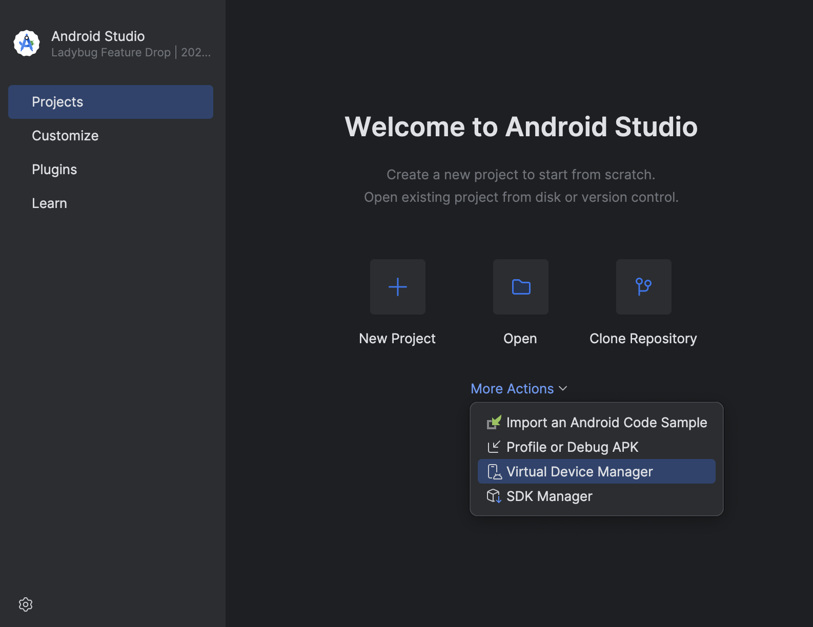
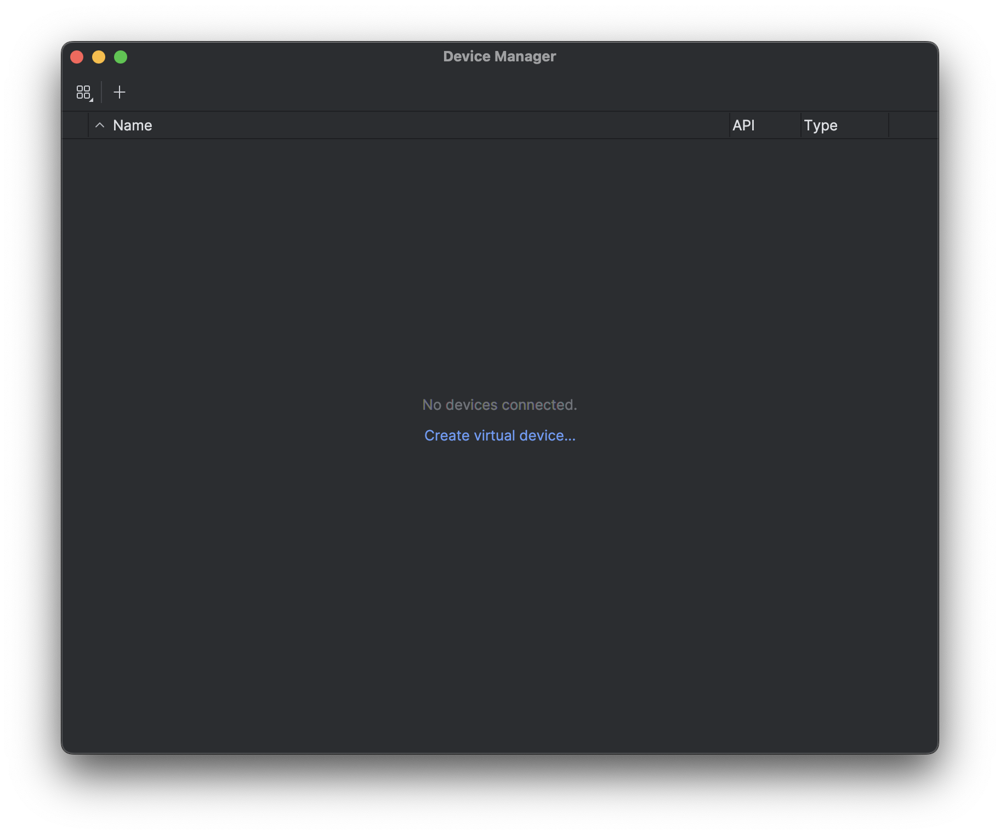
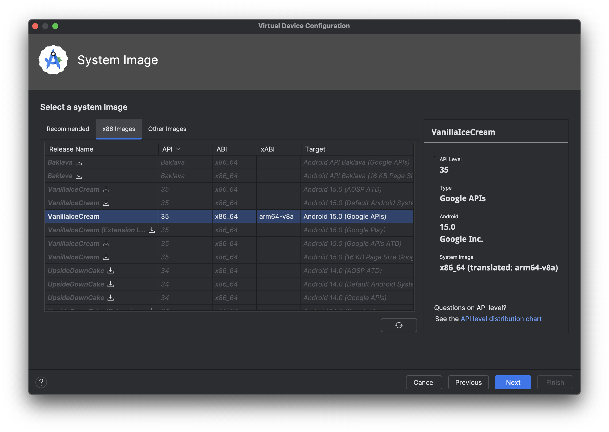
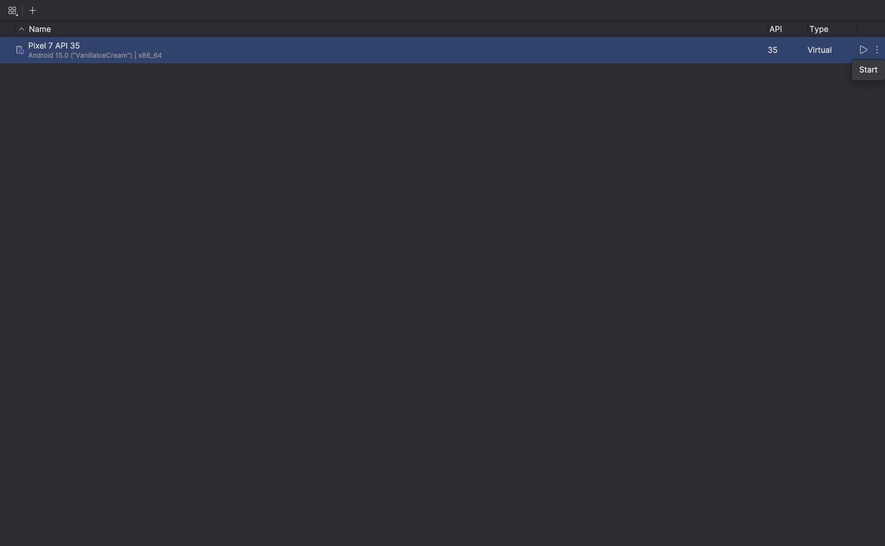

# Setup an Android emulator

You can also check expo documentation on [how to set up an emulator](https://docs.expo.dev/get-started/set-up-your-environment/?mode=development-build&buildEnv=local&platform=android&device=simulated#set-up-an-emulator)

Open "Virtual Device Manager" under the "More Actions" dropdown

Click either the "+" or "Create virtual device" button

I recommend to select "Pixel7" for the hardware

Select one of your downloaded system image or download one

Then click on "Next" and "Finish"

And voilà, you can now run this emulator anytime by pressing the Play button in the Device Manager window.

